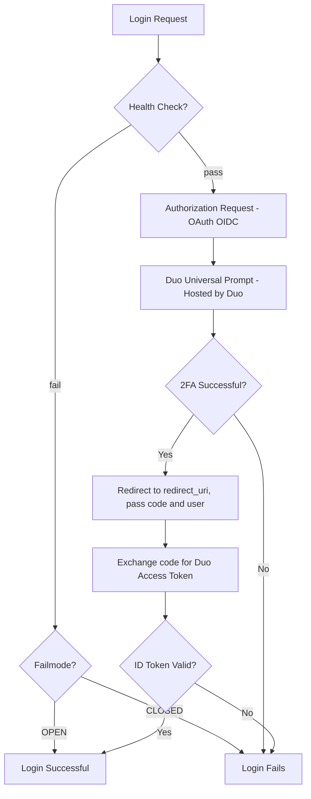

# Overview

A minimal demo rails app using the duo_universal_ruby 2FA API to Duo's WebSDK apps with universal prompt.
The rails app has a login workflow and utilizes the failmode flag for bypassing DUO when there is a duo health_check fail.

- https://github.com/tparsnick/duo_universal_ruby
- https://duo.com/docs/duoweb
- https://duo.com/docs/oauthapi

## PreRequisites
- Have access to Duo Admin account
- Add a `Web SDK` application, which will be enabled with the universal prompt by default
- [Enable user access to the app](https://duo.com/docs/protecting-applications#user-access)
- add a user through the Duo Admin interface.

## Puma server configured for HTTPS using an auto-generated Self-Signed SSL
Puma automatically generates self-signed SSL certificates at runtime, mimicking the `ssl_context='adhoc'` feature from Python's Flask.

## Rails App flow


[mermaid flow editor](https://mermaid.live/)

1. Health Check  
Your application sends a health check to Duo’s service to verify connectivity.

2. Authorization Request (OAuth/OIDC)  
The application constructs a JWT containing a `redirect_uri` and sends an authorization request to Duo’s authorization endpoint.

3. Duo Universal Prompt (Hosted by Duo)  
Duo presents the two-factor authentication prompt on its hosted UI (push, passkeys, etc.).

4. Successful 2FA → Redirect  
Upon successful verification, Duo redirects the user’s browser back to the provided `redirect_uri`.

5. Retrieve Authentication Result (Token Exchange)  
Your application exchanges the authorization code at Duo’s Access Token endpoint to retrieve the authentication result, including contextual information about the 2FA event.


### Notes

- The `redirect_uri` must match between the authorization request and the app’s endpoint handling the authentication result.
- Duo’s flow is a tailored OAuth/OIDC Authorization Code Flow.
- Embedding Duo’s universal prompt in an iframe is disallowed; the prompt must be presented as a full-page redirect.


## 🚀 Getting Started

### 1. Install dependencies

Make sure you have the latest gem system and [Bundler](https://bundler.io/) installed:

```bash
gem update --system
gem install bundler
bundle install
```
### 3. Update config/duo.yml 

Add your settings to connect to the Duo Web SDK. These can be retrieved from the duo admin interface

### 4. run puma and rails
```
bin/rails server
```
check the browser at https://localhost/

### 5. Debug the rails app with the console
```
bin/rails console
```

